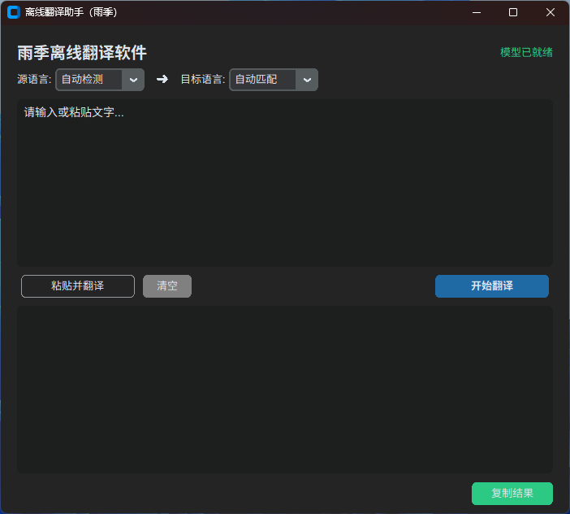
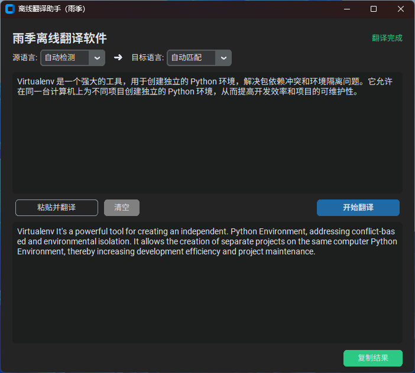

# python实现本地离线翻译软件

## 首先安装 argostranslate

```shell
#创建新的虚拟环境 （或者vscode自动创建）
python -m venv .venv
#激活新环境
.venv\Scripts\activate.bat
#安装插件
pip install argostranslate
pip install pyperclip
#UI版本
pip install customtkinter
```
## 启动
```shell
python.exe .\main.py
```

界面





### 如果是简单demo无UI界面，源码如下
设置环境变量可以指定模型下载目录，否则模型默认目录为：C:\Users\[用户名]\.local\share\argos-translate\packages
```python
import pyperclip
import sys
import os
from pathlib import Path
# 在导入 settings 前，设置环境变量，让settings.home_dir 基于当前工作目录
os.environ["SNAP"] = "任意内容" #为了修改settings.py(from argostranslate import settings)文件中的 home_dir = Path.home()，因为它指向了C:\Users\yujing，
os.environ["SNAP_USER_DATA"] = str(Path.cwd() / "home_dir")
# 现在导入（路径会用上面的环境变量计算）
import argostranslate.package
import argostranslate.translate
import pyperclip
import contextlib
import io
import sys

# ------------------------- 1. 屏蔽所有 Argos 内部警告 -------------------------
@contextlib.contextmanager
def suppress_stderr():
    old_stderr = sys.stderr
    sys.stderr = io.StringIO()
    try:
        yield
    finally:
        sys.stderr = old_stderr

# ------------------------- 2. 检查模型是否已经安装 -------------------------
def model_installed(from_code, to_code):
    installed = argostranslate.package.get_installed_packages()
    for pkg in installed:
        if pkg.from_code == from_code and pkg.to_code == to_code:
            return True
    return False


# ------------------------- 3. 自动下载 + 安装模型（只一次） -------------------------
def ensure_models_installed():
    print("检查离线翻译模型...")

    # 如果已经有模型了，不下载
    if model_installed("zh", "en") and model_installed("en", "zh"):
        print("✔ 模型已安装，跳过下载")
        return

    print("⏳ 首次使用：正在下载中文 ↔ 英文模型...")

    with suppress_stderr():
        available_packages = argostranslate.package.get_available_packages()

    target_pkgs = [
        pkg for pkg in available_packages
        if (pkg.from_code == "zh" and pkg.to_code == "en") or
           (pkg.from_code == "en" and pkg.to_code == "zh")
    ]

    for pkg in target_pkgs:
            print(f"⬇ 下载并安装：{pkg.from_code} → {pkg.to_code}")
            try:
                with suppress_stderr():
                    pkg.install()
                print(f"  ✓ 安装成功：{pkg.from_code} → {pkg.to_code}")
            except Exception as e:
                print(f"  ❌ 安装失败：{e}")

    print("✔ 模型安装完成！已保存到 models/ 下")

ensure_models_installed()


# ------------------------- 4. 自动语言检测 -------------------------
def detect_language(text: str) -> str:
    """自动判断中文/英文"""
    if any('\u4e00' <= c <= '\u9fff' for c in text):
        return "zh"
    letters = sum(1 for c in text if c.isalpha())
    if letters > len(text) * 0.4:
        return "en"
    return "en"


# ------------------------- 5. 离线翻译 -------------------------
def offline_translate(text: str) -> str:
    src = detect_language(text)
    tgt = "en" if src == "zh" else "zh"

    with suppress_stderr():
        translator = argostranslate.translate.get_translation_from_codes(src, tgt)

    with suppress_stderr():
        output = translator.translate(text)

    return output


# ------------------------- 6. 主程序 -------------------------
def main():
    print("=== 离线翻译工具（Argos Translate）===")
    print("自动识别中英文，无需联网")
    print("输入 'q' 退出程序")
    print("-" * 40)

    while True:
        choice = input("\n请选择模式（1=输入文本，2=粘贴剪切板，q=退出）：").strip()

        if choice.lower() == "q":
            print("程序退出～")
            sys.exit()

        if choice == "1":
            text = input("请输入待翻译文本：").strip()
        elif choice == "2":
            text = pyperclip.paste().strip()
            print("📋 剪切板内容：", text)
        else:
            print("❌ 无效选择，请输入 1 或 2")
            continue

        if not text:
            print("❌ 文本不能为空！")
            continue

        result = offline_translate(text)
        print("\n🎯 翻译结果：", result)

        pyperclip.copy(result)
        print("✅ 已复制到剪切板！")


if __name__ == "__main__":
    main()
```